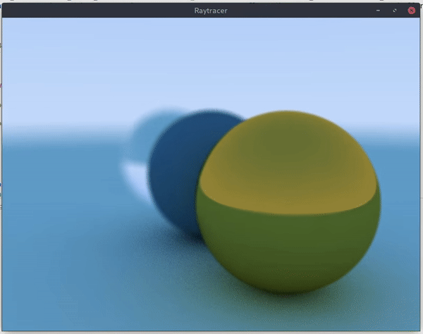

Based on [_Ray Tracing: the Next Week_](http://in1weekend.blogspot.com/2016/01/ray-tracing-second-weekend.html) book

## Cloning
This repository contains submodules for external dependencies, so when doing a fresh clone you need to clone recursively:

```
git clone --recursive git@github.com:Alabuta/RayTracingNextWeek.git
```

Existing repositories can be updated manually:

```
git submodule update --init --recursive -j 8
```





